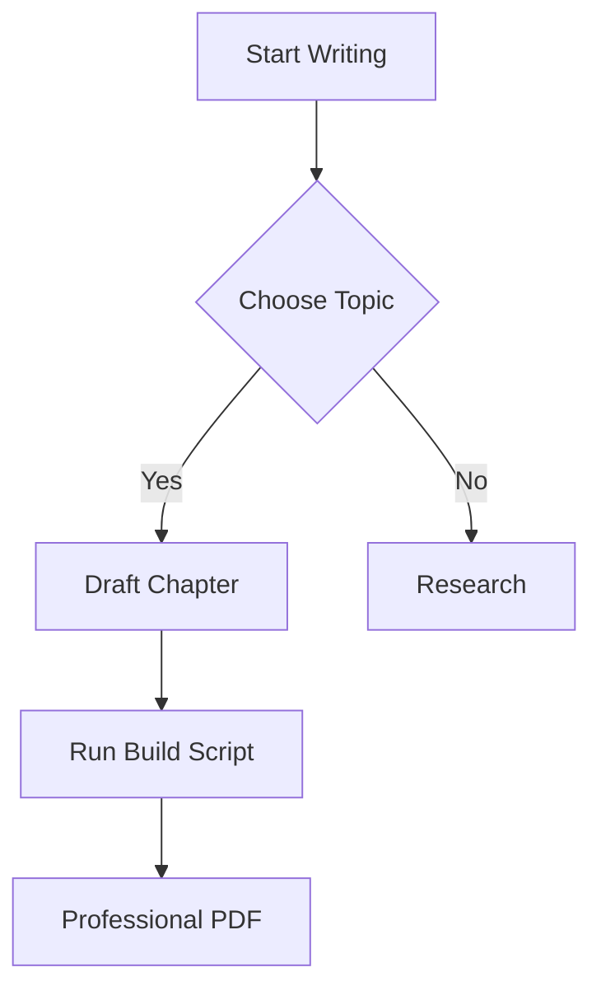

# Writing Your Book with Markdown

This template uses standard GitHub Flavored Markdown (GFM) with extra support for professional typesetting features.

## Basic Formatting

You can use standard **bold**, *italic*, and `inline code`.

- Itemized lists
- Work just as expected
  - Including nested items

### Code Blocks

Code blocks are rendered with the `breezedark` theme:

```typescript
function helloWorld(): string {
  return "Welcome to your new book template!";
}
```

### Mathematical Formulas

You can use KaTeX for high-quality math formulas:

$$ e^{i\pi} + 1 = 0 $$

### Diagrams with Mermaid

Render diagrams directly in your book:



### Adding Images

Store your images in `assets/images/` and link them using relative paths. This ensures they show up in your Markdown editor preview:

```markdown

```

**Output:**


